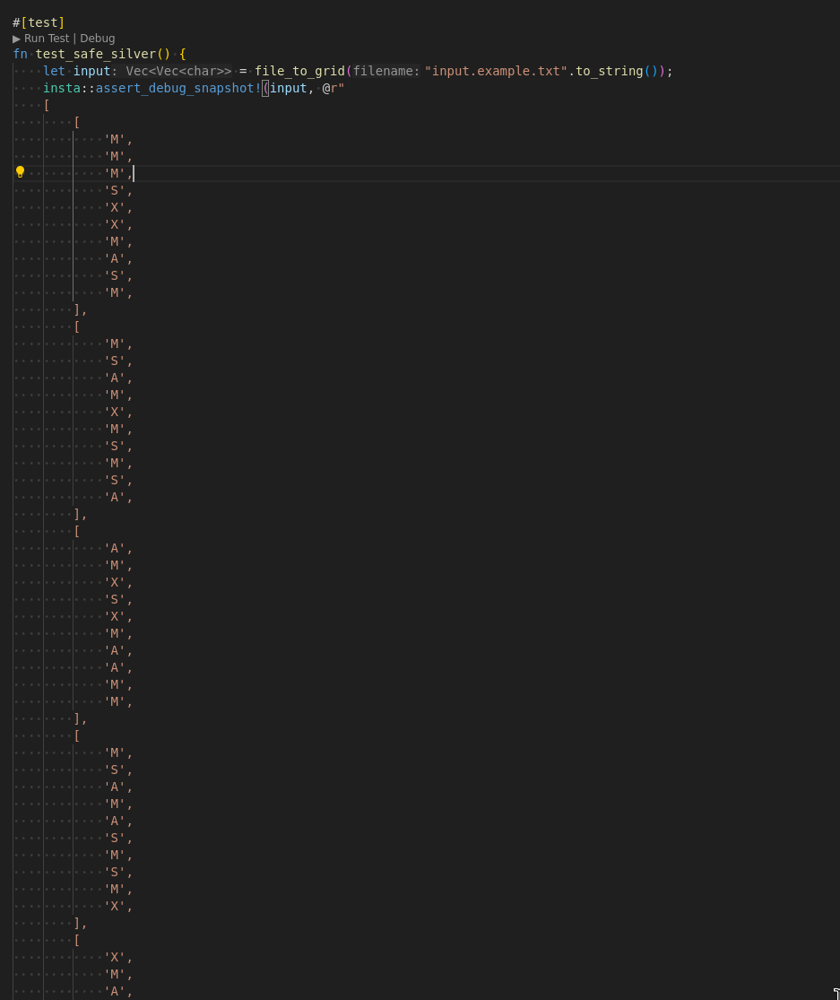

Okay I'm not very good with array programming. My approach will be the following:
- on each position, if it's a `X` or a `S` search in all 8 directions if there is a `XMAS` or `SAMX`.
- somehow handle going out of bounds
- record the start and end position, with start being the `X` and end being the `S`
- dedupe the list (this is how I avoid counting `XMAS` twice or more)
- ???
- profit

I want to test this thouroughly this time which means it's [insta](https://insta.rs/). Ever since programming in Janet for 10 minutes I've been obsessed which inline snapshot tests (see [this chapter](https://janet.guide/testing-and-debugging/) of Janet For Mortals). It's basically like tests except you don't write the output, just review it. Which is great as I don't like writing the output of tests.
"Wait," I hear you saying, "Vec<Vec<char>> doesn't implement display. You are doomed. You are finished. It is over for you". At least that's what I was thinking until I discovered `insta_debug_snapshot!` which does exactly what it says on the tin.

There is however a tiny small problem:



But we can solve this, through the power of wrapper `Vec<Vec<char>>` in another type (can't implement debug or display on an alias because of orphan rules I think):

```rust
struct Grid {
    vec: Vec<Vec<char>>,
}

impl Grid {
    fn from_file(filename: String) -> Self {
        Self { vec: file_to_grid(filename) }
    }
}

impl Display for Grid {
    fn fmt(&self, f: &mut std::fmt::Formatter<'_>) -> std::fmt::Result {
        for row in &self.vec {
            writeln!(f, "{}", row.iter().collect::<String>())?;
        }
        Ok(())
    }
}


fn silver_star(s: &str) -> u64 {
    return 0
}


#[test]
fn test_safe_silver() {
    let input = Grid::from_file("input.example.txt".to_string());
    insta::assert_snapshot!(input, @r"
    MMMSXXMASM
    MSAMXMSMSA
    AMXSXMAAMM
    MSAMASMSMX
    XMASAMXAMM
    XXAMMXXAMA
    SMSMSASXSS
    SAXAMASAAA
    MAMMMXMMMM
    MXMXAXMASX
    ");
}
```

So thus far we managed to successfully avoid array programming for 20 minutes, which I would call a success.

